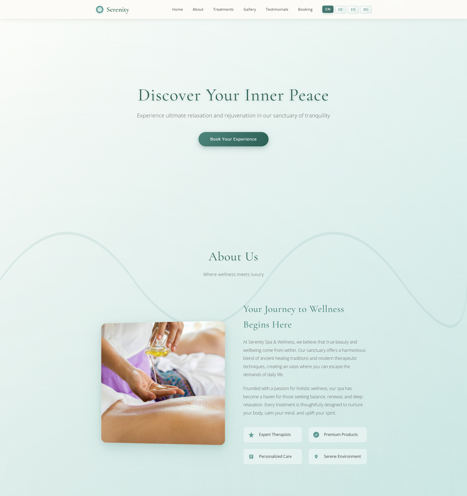

# 🌿 Serenity Spa & Wellness

A premium, fully responsive spa and wellness center website featuring elegant design, smooth animations, and multi-language support.



## ✨ Features

- **Elegant Design** - Premium spa aesthetic with calming color palette
- **Fully Responsive** - Perfect on mobile, tablet, and desktop
- **Multi-Language Support** - English, German, Spanish, and Bulgarian
- **Smooth Animations** - Butter-smooth scrolling and transitions
- **6 Treatment Services** - Massage, Facial, Body Scrub, Aromatherapy, Wellness Package, Hot Stone Therapy
- **Interactive Gallery** - Click-to-enlarge image modal
- **Booking Form** - Integrated appointment booking system
- **Client Testimonials** - Automatic rotating testimonial slider

## 🚀 Live Demo

**[View Live Website](https://serenity-spa-two.vercel.app/)**

## 📸 More Screenshots

<div align="center">
  
[](screenshots/)

</div>

## 🛠️ Technologies Used

- **HTML5** - Semantic markup
- **CSS3** - Advanced animations, gradients, and transitions
- **JavaScript** - Interactive features and language switching
- **Google Fonts** - Cormorant Garamond & Open Sans

## 🎨 Color Palette

- **Forest Green** `#2C5F54` - Primary brand color
- **Jade Green** `#4D857D` - Accent color
- **Sage Green** `#8BA888` - Soft highlights
- **Moss Green** `#5A7C6F` - Complementary
- **Aqua** `#C8E6E3` - Background accent
- **Cream** `#FDFBF8` - Background base

## 📱 Responsive Design

- **Desktop** - Full-featured layout with hover effects
- **Tablet** - Optimized layout for medium screens
- **Mobile** - Hamburger menu, stacked sections, touch-friendly

## 🌍 Multi-Language Support

Switch between 4 languages with a single click:
- 🇬🇧 English
- 🇩🇪 German (Deutsch)
- 🇪🇸 Spanish (Español)
- 🇧🇬 Bulgarian (Български)

## 📦 Installation

```bash
# Clone the repository
git clone https://github.com/Rado4200/serenity-spa.git

# Navigate to project directory
cd serenity-spa

# Open in browser
open index.html
```

## 🚀 Deployment

This project is deployed on **Vercel** for lightning-fast performance and automatic deployments.

## 📄 License

This project is open source and available under the [MIT License](LICENSE).

## 👨‍💻 Developer

Created with ❤️ by **Rado4200**

---

<div align="center">

**[⭐ Star this repository](https://github.com/Rado4200/serenity-spa)** if you found it helpful!

</div>
